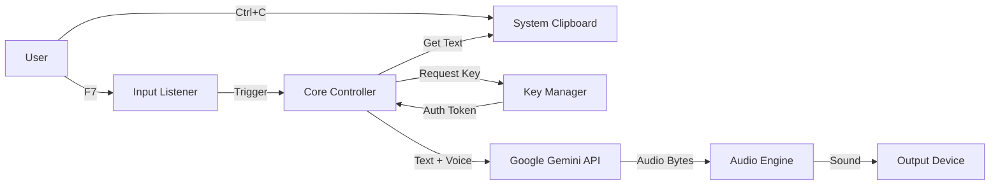

# EchoClip: Cloud-Native Clipboard TTS Architecture

## 1. Overview
**EchoClip** is a lightweight, background Desktop application that converts clipboard text into high-fidelity speech using Google's **Gemini 2.5 Flash TTS API**. 

To overcome the strict Rate Limits of the Google AI Free Tier (3 RPM, 15 RPD), the system implements a robust **API Key Pooling & Rotation Strategy**, inspired by the *Grimoire* knowledge engine. This allows for continuous usage by distributing load across multiple API credentials.

## 2. System Design

### 2.1 High-Level Data Flow



## 3. Core Components

### 3.1 Input Layer (`input_handler.py`)
Responsible for detecting user intent and capturing text.
- **Libraries:** `pynput` (Hotkeys), `pyperclip` (Clipboard).
- **Trigger:** Global Hotkey (`F7` to start, `ESC` to stop).
- **Sanitization:** Cleans clipboard text (removes excess whitespace, non-printable characters) before sending to the API to save tokens.

### 3.2 Key Management Layer (`keys.py`)
*Adapted from the Grimoire project.*
This is the critical infrastructure that makes the Free Tier viable. It manages a pool of API keys defined in `config.toml`.

*   **State Persistence:** Maintains a `key_state.json` file on disk to track:
    *   `last_used_timestamp`: For pacing requests (RPM limit).
    *   `requests_today`: To enforce the 15 Daily Requests limit.
    *   `total_tokens`: To monitor TPM limits.
    *   `cooldown_until`: Temporary lockout for 429 errors.
*   **Selection Algorithm:**
    1.  Filter out keys that have hit the **Daily Limit** (15 requests).
    2.  Filter out keys currently in **Cooldown** (429/503 errors).
    3.  Select the key with the **least recent usage** (Round-Robin with Pacing) to maximize the interval between requests on a single key.
*   **Rate Limits (Hardcoded for `gemini-2.5-flash-preview-tts`):**
    *   **RPM (Requests Per Minute):** 3
    *   **TPM (Tokens Per Minute):** 10,000
    *   **RPD (Requests Per Day):** 15

### 3.3 Service Layer (`client.py`)
Handles the communication with Google's GenAI SDK.
- **Library:** `google-genai`
- **Model:** `gemini-2.5-flash-preview-tts` (or equivalent supported endpoint).
- **Voice Configuration:**
    - **Voice:** `Zubenelgenubi` (Deep, resonant, professional).
    - **Language:** `pt-BR` (Portuguese Brazil).
- **Error Handling:**
    - Catches `429 Resource Exhausted`.
    - Triggers the `KeyManager` to mark the current key as "cooldown" or "exhausted" and immediately retries with the next available key.

### 3.4 Audio Output Layer (`audio.py`)
Handles the immediate playback of the generated audio stream.
- **Libraries:** `sounddevice` and `soundfile` (Python native) or `subprocess` calling `mpv`/`aplay`.
- **Concurrency:** Runs in a separate thread/process to ensure the UI/Keyboard listener does not freeze while playing.
- **Interrupt:** Must support a `SIGTERM` or `stop()` signal when the user presses `ESC`, instantly killing the audio stream.

## 4. Configuration Structure (`config.toml`)

The application is configuration-driven.

```toml
[gemini]
# Multiple keys separated by pipe |
api_keys = "AIzaSyD...|AIzaSyE...|AIzaSyF..." 
model_name = "gemini-2.5-flash-preview-tts"
voice_id = "Zubenelgenubi"

[audio]
speed = 1.0
volume = 1.0

[system]
hotkey_start = "F7"
hotkey_stop = "<esc>"
```

## 5. Technical Workflow

1.  **Initialization:**
    *   Load `config.toml`.
    *   Load `key_state.json`.
    *   Reset `requests_today` counters if the date has changed since the last run.
    *   Start Background Listener (`pynput`).

2.  **Execution (User presses F7):**
    *   **Step 1:** App grabs text from Clipboard.
    *   **Step 2:** App plays a generic "Thinking" sound effect (UI feedback).
    *   **Step 3:** `KeyManager` is queried for a valid key.
        *   *Scenario A:* Key found. Proceed.
        *   *Scenario B:* All keys exhausted/cooldown. Play "Error" sound and log message.
    *   **Step 4:** Request sent to Gemini API.
    *   **Step 5:** Response (Audio Bytes) received.
    *   **Step 6:** Audio Engine plays the stream.
    *   **Step 7:** `KeyManager` updates `key_state.json` (increments request count for that key).

3.  **Interruption (User presses ESC):**
    *   Audio thread is terminated immediately.
    *   Clipboard listener remains active.

## 6. Rate Limit Handling Strategy

Given the strict **3 RPM** limit:
*   **Single Key:** You can only read 1 paragraph every 20 seconds.
*   **10 Keys:** You can read 30 paragraphs per minute (virtually unlimited for human reading speed).

The `KeyManager` must implement **Pacing**:
If Key A was used at `10:00:00`, it cannot be used again until `10:00:20`. The system must automatically skip Key A and grab Key B if a request comes in at `10:00:10`.

## 7. Dependencies

*   `google-genai`: Official SDK.
*   `pynput`: Global hotkeys.
*   `pyperclip`: Clipboard access.
*   `sounddevice` & `numpy`: Audio playback.
*   `toml`: Config parsing.
*   `rich`: Console logging (optional, for debugging).

## 8. Future Improvements
*   **Streaming API:** Implement chunked streaming to play audio *while* it is being generated, reducing latency for long texts.
*   **Cache:** Hash the clipboard text content. If the same text is requested again, play the cached local audio file instead of burning an API credit.